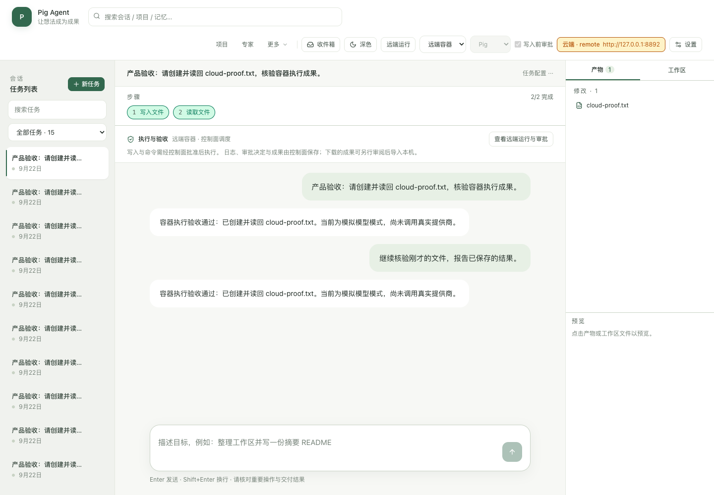

# 0.2.0 验证证据

2026-09-22 本地验证，源码基线 `51d42ff`。环境为 macOS arm64、Docker Desktop、Node 24.21.0、pnpm 11.19.0、Playwright 1.63.0 + 系统 Chrome。文件摘要见 [manifest.json](manifest.json)。

| 验收 | 可复现命令 | 结果 |
| --- | --- | --- |
| 单元/集成 | `pnpm test` | 612 个测试、87 个文件通过 |
| 集群协议 | `node scripts/smoke-cluster-control.mjs` | [14 场景](control.json)，含竞争、幂等、公平性、期限与旧节点隔离 |
| 真实 Runner | `node scripts/smoke-cluster-runners.mjs` | [双节点四容器及故障矩阵](runners.json)，60.321 秒，容器/网络零残留 |
| 浏览器端到端 | `pnpm product:smoke` | [审批、下载、恢复、跟进](flow.json)与[管理界面](admin-ui.json)通过 |
| 桌面 | `pnpm desktop:build && pnpm desktop:smoke` | 真实 Electron 启动/重启、凭据隔离、流式对话、消息去重、本地CLI集成通过 |
| 真实提供商 | 授权本地平台中的 DeepSeek 渠道 | [审批后执行、产物精确比对](real-model.json)，3次模型调用 |

协议期限场景使用隔离数据库时间注入；Runner矩阵真实发送SIGKILL/SIGTERM和关闭控制实例。浏览器竞态使用受控延迟响应；阅读位置使用标记清晰的UI消息夹具。以上不是持续负载、跨主机网络分区、数据库故障切换或生产容量测试。

## 实际渲染截图

- [工作台：远端会话与跟进](flow-conversation.png)
- [执行前审批](flow-approval.png)
- [Runner 集群](admin-runners.png)
- [执行设置](admin-settings.png)
- [390px 工作台设置](settings-mobile.png)
- [390px 管理后台](admin-mobile.png)

原始测试截图与JSON保存在忽略提交的data/product-evidence及data/cluster-local/evidence；CI也会保留14天构建附件。此目录仅保存脱敏验收证据，不包含令牌、API Key或用户工作文件。执行语义和未交付能力见[工作记录](../../productization-worklog.md)。
