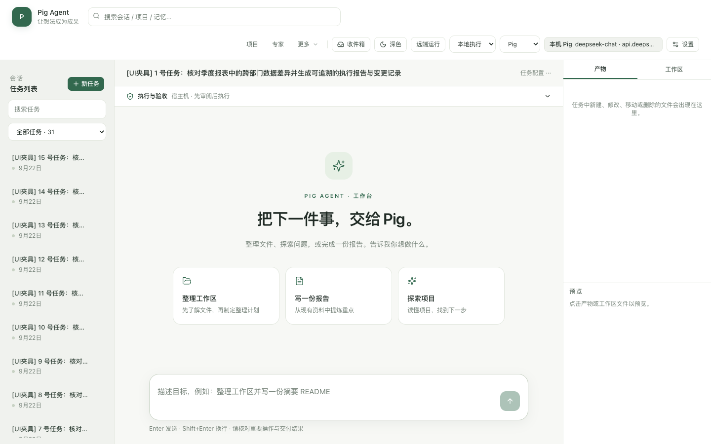
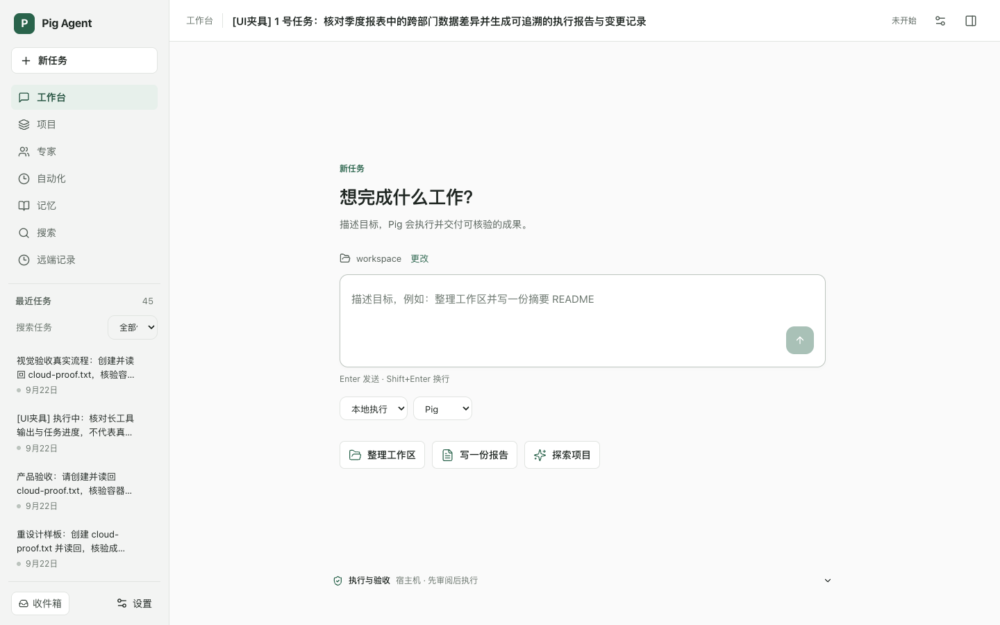
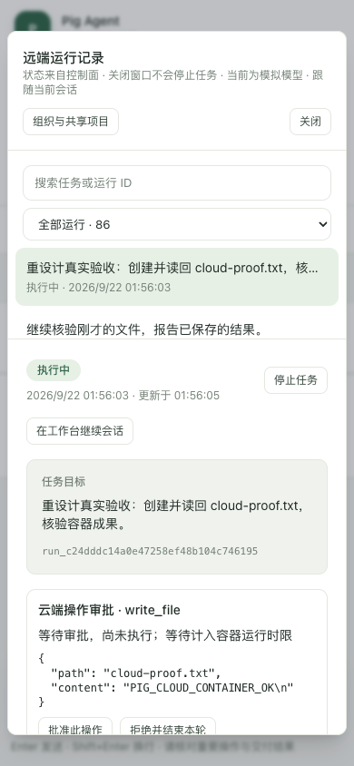
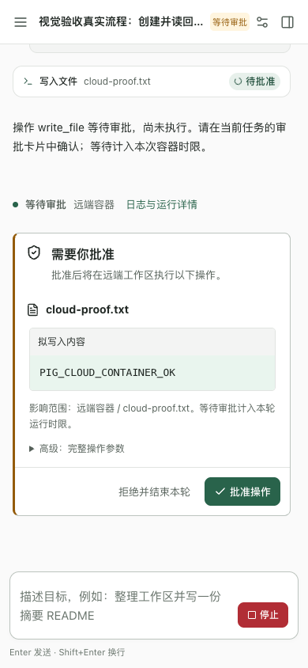

# 工作台重设计验收记录 · 2026-09-22

起点为 `bf41409`，问题依据 [独立验收](acceptance-review-2026-09-22.md) 和 [重设计说明](ui-redesign-brief.md)。本次没有沿用上一版“已验收”的结论，也不以测试数量替代界面审查。

[打开前后对照索引](evidence/redesign-2026-09-22/index.html) · [归档校验清单](evidence/redesign-2026-09-22/archive-manifest.json) · [工作记录](redesign-worklog.md)

## 实际范围与环境

- 浏览器为本机真实 Chrome，由 Playwright 操作；尺寸为 1440×900、1280×800、390×844，覆盖浅色和深色。
- 新工作台验收服务为 `127.0.0.1:8799`，数据目录 `data/redesign-local/store`。最终执行夹具使用 `data/redesign-local/workspace`；独立集群入口为 `127.0.0.1:8892`，两个控制面、两个 Runner，模型使用 mock。
- 旧 F2 复现使用原验收数据中的远端运行和隔离文件，随后新流程移入 redesign 隔离工作区。设置与页面脚本现对工作区路径增加严格检查，拒绝误用其他目录。此前设置验证只修改设置值、页面验证只创建带验收标记的记录，没有写用户工作区文件。
- 未把 8797/8890 用户平台作为本轮故障注入或重复模型测试环境；截图及 JSON 不包含 API Key、控制面 Token、Runner 尝试凭据或 outbox 内容。
- JSON 时间戳为 UTC，文档日期为 Asia/Shanghai。该环境只能证明本机已验证行为，不能证明跨主机高可用或生产吞吐量。

## 正确性缺陷闭环

| 缺陷 | 实现行为 | 本轮证据 |
| --- | --- | --- |
| F1：完成回传短暂故障丢失成功成果 | 区分执行失败与结果交付失败；先持久化原始完成消息到私有 outbox，再以稳定提交 ID 交付。控制面事务保存完成收据，识别相同内容重放；取消竞争不被终态重放逆转。 | [真实 Docker 三组对照](evidence/redesign-2026-09-22/reliability/finish-fault.json)：正常、提交前 503、提交成功后响应丢失均 succeeded，保留一份成果。[双控制面并发与代次协议](evidence/redesign-2026-09-22/reliability/completion-fencing.json)。 |
| F2：远端文件预览误读本机同名文件 | 产物携带远端 run/artifact 身份；预览、版本与下载走已有授权接口。本机落盘使用独立显式导入审阅流程。 | [来源验证](evidence/redesign-2026-09-22/artifact-source.json)：本机无文件、同名不同内容、两个运行版本、切换任务、导入前后；实际请求始终指向对应远端成果接口。 |
| F3：旧节点迟到注册挤掉新代 | 保存被替代代次；当前代次注册重放幂等，失效代次不可通过迟到重试重新取得所有权。 | [协议证据](evidence/redesign-2026-09-22/reliability/completion-fencing.json)：A→B→迟到 A 不使 B 活动任务失效，并发替换后旧代不能回来。 |

F1 的持久化边界和排障说明见 [完成交付文档](completion-delivery.md)。结果超过有效租约仍会被拒绝并保留待核验文件；不会借恢复机制绕过失效凭据，也不自动重放具有外部副作用的任务。

## 结构与交互改动

| 原问题 | 本次变化 | 对照入口 |
| --- | --- | --- |
| U1、U6：多行全局顶栏挤占首屏 | 全局入口进入左栏；任务标题栏只保留上下文操作；手机抽屉导航。实测桌面 60px、手机 56px。 | 索引中的空态、执行、审批；[尺寸记录](evidence/redesign-2026-09-22/after/workbench-matrix.json)。 |
| U2：空任务常驻无内容检查面板 | 输入、工作区与执行配置形成新任务区；没有成果时不显示空检查器；成果出现后按需打开。 | `empty-*` 对照。 |
| U3：层级与状态含混 | 正文、执行摘要、可展开工具细节、审批和成果分层；长标题改两行，失败/待批准状态单独表达。 | `executing-*`、`long-content-*`、`error-*`。 |
| U4：设置单列技术说明堆叠 | 六组导航：模型、执行、工作区、远端、外观、高级；技术协议与配置来源收进高级；保存结果与作用范围明确。 | `settings-*` 与 [实际操作](evidence/redesign-2026-09-22/after/settings-check.json)。 |
| U5：审批必须跳全局记录 | 当前会话内展示操作对象、拟写入内容、影响范围及批准/拒绝。参数默认折叠；成果、日志、版本留在任务上下文。 | `approval-*`、`result-*`。 |
| U7、U8：管理端风格独立、Runner 大卡片难扫描 | 共享视觉 token；Runner 紧凑列表、在线/历史离线筛选、搜索和详情；真实权限保护下查看任务日志与成果。 | `admin-runners-*` 对照及 [管理端证据](evidence/redesign-2026-09-22/admin/evidence.json)。 |
| 其余页面继续叠加第二条常驻侧栏 | 项目、专家、自动化、记忆采用全宽详情和可搜索目录抽屉；搜索具备独立输入与分类结果。 | `page-*`、`catalog-*` 与 [真实 CRUD](evidence/redesign-2026-09-22/after/pages-flow.json)。 |

## 实际操作与视觉自审

- [真实容器用户链路](evidence/redesign-2026-09-22/real-flow/flow.json)：创建 → 会话内审批 → 下载内容精确匹配 → 刷新恢复 → 第二轮跟进 → 拒绝后显式重试 → 成功 → 取消确认；未使用截图夹具代替这条链路。
- [设置七项检查](evidence/redesign-2026-09-22/after/settings-check.json)：轮询和切组不覆盖草稿；非法地址阻止保存；关闭未保存内容需明确选择；保存后刷新保持；真实控制面访问检查；手机保存按钮可见；主题刷新保持。
- [其他页面十项检查](evidence/redesign-2026-09-22/after/pages-flow.json)：真实创建项目、待办、专家、仅手动自动化、记忆；目录搜索、手机选择和搜索结果跳转。未触发这些手动自动化的模型执行。
- [任务上下文六项检查](evidence/redesign-2026-09-22/after/session-context.json)：迟到取消/绑定/任务读取响应不切回旧任务；多任务流式状态隔离；手机检查器与导航焦点限制、Escape 关闭和焦点恢复。
- [集群协议](evidence/redesign-2026-09-22/cluster/control.json)：双控制面14场景；为确定性竞争使用已注册的模拟节点，队列、租约和执行时限部分采用数据库时间戳故障注入。与真实节点测试分开记录。
- [额外 DNS 故障与修复](evidence/redesign-2026-09-22/cluster/dns.json)：停止控制面后，其服务名被 Docker 转发到宿主 fake-IP DNS，导致严格审批 POST 返回502。隔离内部控制网络、限定DNS后备并修复配置挂载/重载后，未知别名返回SERVFAIL；保留原严格断言，不启用不安全POST重试。
- [真实2×2容器测试](evidence/redesign-2026-09-22/cluster/runners.json)：两个Runner各2槽、4个并发执行容器，节点强杀、控制面退出后的存活节点执行、SIGTERM有界退出及零遗留执行容器/网络，整组耗时59.140秒；这不是容量基准。
- [管理端检查](evidence/redesign-2026-09-22/admin/evidence.json)：真实节点筛选、任务成果读取与下载、三尺寸无页面横向溢出、手机导航键盘操作。

最终组合执行证据另存于 [final-product/flow.json](evidence/redesign-2026-09-22/final-product/flow.json)、[成果来源](evidence/redesign-2026-09-22/final-product/artifact-source.json)、[管理端16项](evidence/redesign-2026-09-22/final-product/admin-ui.json)。最终组合使用独立8798验收服务和8892 mock集群，未指向用户服务。

截图检查不只看空页面。实际查看了手机浅/深审批、完成成果、错误恢复、长内容、设置分组、项目、专家、自动化、搜索和管理端。自审发现并迭代的具体问题包括：设置导航提示挤窄标题、无样式次按钮、重复空白、嵌套 Escape 重新打开确认、搜索清空按钮被挤成竖排、跨页面遗留任务错误条、长任务标题无法区分、审批工具行误标为进行中、移动抽屉焦点遗漏。最终组合还复现并修正了重复选择同一个成果版本会清空文件列表的问题；相同版本选择现为无状态变化，F2完整路径重新通过。

## 截图样例（同尺寸）

桌面空态，1440×900、浅色。任务列表为明确标记的 UI 夹具，比较布局，不代表执行成果。

| 改版前 | 改版后 |
| --- | --- |
|  |  |

手机审批，390×844、浅色。两侧均来自真实 mock 容器任务；对比全局记录弹窗和当前会话内审批。

| 改版前 | 改版后 |
| --- | --- |
|  |  |

完整尺寸与主题见[64组对照索引](evidence/redesign-2026-09-22/index.html)，以及可直接在 GitHub 浏览的 [before](evidence/redesign-2026-09-22/before/) / [after](evidence/redesign-2026-09-22/after/) 图片目录。

## 截图来源与不能据此推断的内容

归档包含 64 组**实际同尺寸**前后配对：原始核心矩阵 54 组，加其余页面的 10 组。缺少匹配尺寸时索引不会用近似尺寸替代。

- 原始核心基线覆盖空态、设置、长内容、执行、审批、成果、断线、恢复和 Runner，每类三尺寸、两主题。
- 原版管理端没有深色模式；其深色请求截图仍显示原版不支持的状态，这是基线事实。
- `page-*` 的“前”是在新全局框架已完成、其余页面内容尚未重构时补拍，因此仅用于对照页面主体，不能宣称它们是完整旧版本截图。
- 至少 15 条长中文标题、长 Markdown、代码块和长工具输出使用明确标记的 UI 夹具。改版后的执行态压力截图使用夹具；真实 mock 容器通常很快进入审批，不把稳定截图误称为真实持续负载。
- 错误/恢复截图注入浏览器远端请求断线；其结果不能替代控制面或 Runner 故障验证。原版执行态截图连续切换尺寸时可能已经进入等待审批。
- 浏览器“无横向溢出”不代表视觉质量合格。旧专家手机页面虽无溢出，却只有狭窄详情列和竖排按钮；本次实际截图验证它已变成全宽详情。

## 验证状态与边界

| 检查 | 本轮实测结果 |
| --- | --- |
| `pnpm test` | 93 个文件、632 个测试通过；本轮最终日志记录开始于本地 02:39:08，耗时 3.44 秒。 |
| 控制面、Runner TypeScript 检查 | 通过。 |
| `pnpm desktop:build` | 通过；保留构建工具的大于 500KB bundle 警告，未据此声称性能优化。 |
| `pnpm desktop:smoke` | 首次启动和重启通过；覆盖加密凭据、认证隔离、流式响应、任务去重与原生执行适配。 |
| 新版 8797 实际浏览器 | 导航可用、无页面运行时错误；升级前后设置哈希保持，9个用户任务保留。 |
| 核心真实容器与各浏览器专项 | 见上述归档 JSON，均有真实操作记录。 |
| 最终组合 `product:smoke` | 全新临时数据目录的最终完整运行通过，退出码0；真实链路8项、设置/导航/断线、创建竞态、运行跟随、上下文6项、F2来源/版本/下载/导入、管理端16项均通过。最后管理端时间戳为2026-09-21T18:55:50.342Z。 |

本轮记录与上一轮测试数分开，不引用旧 612 个测试作为本轮结果。

CI 首次独立环境运行曾失败，原因是测试前置数据依赖，不是降低产品断言即可通过的问题：显式重试沿用既有语义建立恢复会话，旧流程只在该会话产生1次成功运行；此前本地反复运行留下的旧会话恰好有2次成功版本，F2脚本误选它而掩盖缺失前置条件。修正后每次组合测试使用新的 `mkdtemp` 数据目录，经 `PIG_TEST_DATA_DIR` 传递；F2固定读取本轮 `flow.json` 的 sessionId，并从控制面权威会话历史查找成功运行。真实流程在重试成功后增加一次跟进与审批，确实产生两个成功版本再取消。原有双版本、下载内容和本机同名隔离断言保留，并增加恢复会话第二版本检查；本次全新数据完整运行已通过。归档中 `final-product/flow.json` 的 sessionId 与 `artifact-source.json` 的 session 一致。

该修正仅涉及验收脚本与数据隔离，生产实现没有因此更改，单元测试数量仍为632。每个提交的独立 CI 结果以 [PR #84 检查记录](https://github.com/zhoupf0916/pig-agent/pull/84/checks) 为准；本地通过不替代独立 CI。

尚未声称或实现的保证：exactly-once 执行、单机持久 outbox 的跨主机复制、生产容量、长时间控制面不可用后的无条件结果接纳。控制面、数据库和 Docker 主机的生产冗余仍需独立部署设计。本轮为本机真实 Chrome 和 Electron 构建环境；没有额外宣称 Safari、Firefox、Windows、Linux 桌面或真实移动设备验证。

## 复现入口

```sh
pnpm cluster:up
node scripts/redesign/start.mjs
# 另一个终端：确认隔离工作区和 mock 连接已配置，勿指向用户平台
node scripts/redesign/settings-check.mjs
node scripts/redesign/pages-flow.mjs
node scripts/redesign/capture-after.mjs
PIG_ADMIN_BASE=http://127.0.0.1:8892 node scripts/redesign/admin-check.mjs
node scripts/redesign/evidence-index.mjs
node scripts/redesign/archive-evidence.mjs
```

首次运行时，在 8799 设置中将工作区设为仓库下 `data/redesign-local/workspace` 的绝对路径，远端地址设为 `http://127.0.0.1:8892`，访问令牌使用独立集群私有 `data/cluster-local/stack.env` 中的 MEMBER_TOKEN；不要公开此文件，也不要改用用户平台地址。

F1/F3 命令及运行时边界以 [完成交付文档](completion-delivery.md) 为准。脚本需要项目依赖、本机 Chrome 和已启动的独立 mock 集群；测试可能创建带验收标记的隔离记录。
