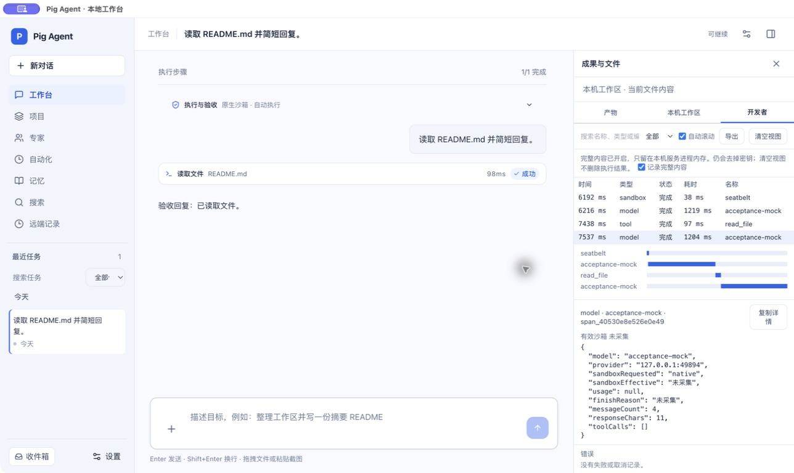

# 运行时优化与 Electron 调试器独立验收

日期：2026-09-23。结论：**未通过整体验收；当前是部分实现。**

依据 `runtime-debugger-cursor-brief-2026-09-23.md`，核对工作树实现和工作记录，独立构建、测试，并实际操作隔离 Electron。未修改业务代码、未提交或推送，也未调用真实付费模型。

## 阻塞问题与下一次验收标准

### 1. P1：文本内容的敏感信息未可靠脱敏

`apps/server/src/agent/debug-trace.ts:21` 只处理 Bearer、sk 前缀和部分 URL 查询参数。结构化字段名脱敏不覆盖工具输出、错误信息等字符串里的凭据。

独立调用 `redactDebugText`，使用纯合成标记 `SYNTHETIC_CANARY_NOT_A_REAL_SECRET`，以下四种输入处理后均仍含原标记：

- `Cookie: session=<标记>`
- `X-API-Key: <标记>`
- `password=<标记>`
- `https://user:<标记>@example.invalid/x`

这证明脱敏缺口，不表示发现真实密钥泄露。开启内容记录后，相关字符串可能进入调试详情与导出。必须先补失败测试，验证记录入口、详情和导出均不保留这些合成凭据；同步修正工作记录中过宽的脱敏声明。

### 2. P1：开启完整内容仍没有模型输入输出

实际 Electron 开启“记录完整内容”，发送“读取 README.md 并简短回复。”，成功执行读文件并返回结果。选中模型调用，详情仅有 `messageCount`、`responseChars` 和工具名称等；没有实际 messages、响应正文、工具定义或完整调用参数。`finishReason` 是“未采集”。

源码 `apps/server/src/agent/runtime.ts:338` 与页面一致；工具参数也使用摘要，输出截取 2,000 字符（同文件第 491 行）。开关名称与实际能力不一致。

下一次验收：默认关闭正文；显式开启后能检查经过脱敏的实际请求和响应，区分缺失、截断和空值，长内容有明确截断说明。截图见下方。

### 3. P1：有效沙箱字段不是实际执行证据

`apps/server/src/agent/runtime.ts:488` 用 `cachedSandbox.available` 决定工具的 `sandboxEffective`。该缓存来自能力探测，不能证明当前工具已在该后端执行。主机模式或不经过该沙箱的工具也可能被错误标注。

这是代码审查发现，本次没有切换主机执行来做破坏性探测。下一次验收应分别验证原生沙箱、主机模式、待审批和沙箱启动失败；有效后端必须来自当前调用的执行结果，尚未执行不得标记为已使用沙箱。

### 4. P1：缺少运行中的调用与远端实时诊断

本地模型 span 在调用返回或抛错后才记录（`runtime.ts:328`），不能实时定位尚未返回的模型调用，未接入首 token 耗时。远端在 `cloud-runner.ts:250` 和 `:289` 发送结束/失败快照；长任务运行中或 Runner 硬退出前的调用没有实时交付保证。

下一次验收：请求开始即出现进行中条目，同一条目更新至终态；能区分排队、模型等待、工具执行与审批等待。用本地 mock 和真实启动的远端 Runner 验证慢请求、审批、取消、异常退出与重连。远端目前尚未独立运行验证，不予判定通过。

### 5. P1：运行体验专项未整体交付

开发工作记录明确列出尚未实现的发送反馈、SSE 合并、统一执行状态、审批取消覆盖、只读工具并行、历史压缩和失败分类重试；也没有固定任务集的冷/热 P50/P95。

因此不能把新增开发者标签页视为整个专项完成。下一轮先修上述诊断正确性，再按原优先级补齐运行体验；给出相同环境、任务和负载下的前后测量，区分模型等待与产品开销。

## 独立验证结果

| 项目 | 结果 |
| --- | --- |
| `pnpm check:architecture` | 通过 |
| `pnpm typecheck` | 通过 |
| cloud、worker 各自 typecheck | 通过 |
| `pnpm test` | 126 个文件、758 项全部通过 |
| `pnpm desktop:build` | 通过；仍有大 bundle 提示 |
| 隔离 Electron 实际读文件对话 | 成功；开发者页有沙箱探测、模型和工具条目 |
| 完整输入输出 | 不通过，见问题 2 |
| 文本脱敏合成探针 | 四种格式均未隐藏标记，见问题 1 |
| 远端 Runner 调试端到端 | 本轮未验证，不计作通过 |
| 冷/热性能基准 | 缺失，不作性能改善结论 |

原先 Codex 重试测试的失败本次已不再出现。测试全绿不替代调试数据正确性与交互验收。

环境：macOS arm64，Node 24、Electron 44.4.3，隔离用户目录，本机模拟模型每次等待约 1.2 秒。实际执行两次模型调用和一次成功的 `read_file`；未触碰用户原有会话。构建、测试日志保存在本地忽略目录 `data/runtime-debugger-review-build.log` 与 `data/runtime-debugger-review-tests.log`。

## 实际截图

独立运行截图，1288 × 768，显示完整内容开关开启但模型详情只有计数：

此截图验证桌面实际渲染和缺失信息，不作为手机、远端或全部异常路径的通过证据。下一次交付需补齐上述阻塞项及对应操作证据后重新验收。
