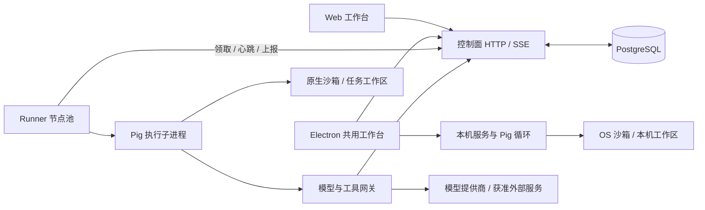

# Pig Agent 技术实现与亮点手册

> 持续维护文档，面向项目开发、技术复盘和面试准备。最后核对：2026-09-26，已发布代码基线 `62d9cf6`；其后核心交互与市场增量尚未提交/部署，单列于下文。本文描述已经存在的实现；路线图单独列出，不把设计意图当成交付能力。产品与依赖边界以 [architecture.md](architecture.md) 为准，本文负责解释具体实现、取舍和证据。
>
> 本次是文档梳理，没有重新运行线上故障注入或付费模型。下文性能、测试和部署数字均注明原验收口径；它们不是持续有效的生产承诺。

## 阅读导航

1. [项目定位与核心亮点](#1-项目定位与核心亮点)
2. [整体架构、数据归属与一次任务](#2-整体架构数据归属与一次任务)
3. [上下文管理：问题、算法与完整链路](#3-上下文管理问题算法与完整链路)
4. [长期记忆与记忆保鲜](#4-长期记忆与记忆保鲜)
5. [评测体系：如何证明改动有效](#5-评测体系如何证明改动有效)
6. [可恢复执行与分布式调度](#6-可恢复执行与分布式调度)
7. [链路观测与运行体验](#7-链路观测与运行体验)
8. [项目、文件、协同和自动化](#8-项目文件协同和自动化)
9. [技能、专家、插件与 MCP](#9-技能专家插件与-mcp)
10. [账号、预算、审批与执行安全](#10-账号预算审批与执行安全)
11. [Web、桌面、构建与部署](#11-web桌面构建与部署)
12. [验证证据与能力边界](#12-验证证据与能力边界)
13. [简历表述与面试追问](#13-简历表述与面试追问)
14. [维护规则与后续路线](#14-维护规则与后续路线)

## 1. 项目定位与核心亮点

Pig Agent 是支持本机与远端执行的 Agent 工作台。用户提交目标，运行时循环调用模型与工具，在权限允许的工作区内执行，遇到受控操作等待审批，最后交付回复和文件。项目、技能、自动化、协同和调试围绕同一套任务执行链路展开。

这里需要区分三个概念：**模型**生成下一步文本或工具调用；**Agent 运行时 / harness**维护对话、上下文、工具循环、审批与停止条件；**控制面**负责账号、任务归属、调度、租约、配额和状态。更换模型不等于更换控制面，接入 Codex 也不意味着 Pig 的运行时内部变成了 Codex 内核。

### 1.1 有代码与证据支撑的亮点

| 亮点 | 解决的实际问题 | 实现抓手 | 能证明到哪里 |
| --- | --- | --- | --- |
| 有界上下文与原文召回 | 长任务忘记目标、更正或日志中部证据 | 不可变转录、完整工具组、结构化摘录、`recall_context` | 合成回归和真实工具循环成立；尚无真实模型 A/B 质量结论 |
| 版本化评测体系 | 凭感觉判断“记忆更好” | 冻结基线、相同预算、明确评分、版本指纹、CI 门槛 | 30 个合成变体的输入验收可复现；不是 30 个独立业务任务 |
| 有边界的故障恢复 | Runner 退出后任务丢失，或重试重复写入 | 消息与工作区联合检查点、safe/unsafe、尝试令牌、原 deadline | 两控制面两 Runner 实际故障注入；不保证任意外部副作用 exactly-once |
| 关联到运行与尝试的观测 | 用户只知道“慢”，无法定位 | 排队/准备/模型/工具/审批/上下文耗时、partial 标记 | 可以解释已采集阶段；尚不是浏览器到模型的完整分布式追踪平台 |
| 控制面权威调度 | 多节点同时领取越过容量限制 | PostgreSQL 事务锁、行锁、租约、账号/项目/节点并发 | 支持多实例协作；单机部署仍有主机和数据库单点 |
| 扩展能力有执行边界 | 技能只有提示词，插件越权访问 | 技能资源包、任务快照、专家绑定、MCP 逐次审批 | 有可执行资源和外部工具接入；不是任意插件市场或完整 MCP 全协议 |

最适合深入讲解的是“上下文管理 + 评测”，因为它包含清楚的问题定义、算法取舍和可重复对照；恢复与观测则补上后端一致性、故障语义和工程验证。

## 2. 整体架构、数据归属与一次任务

### 2.1 仓库模块

| 目录 | 责任 | 关键入口与实现 |
| --- | --- | --- |
| `apps/web` | 共用工作台、消息/文件/审批 UI、HTTP/SSE 客户端 | [src](../apps/web/src)、[transcript-sync.ts](../apps/web/src/lib/transcript-sync.ts)、[DeveloperPanel.tsx](../apps/web/src/components/DeveloperPanel.tsx) |
| `apps/server` | 本机 API、Pig 循环、工具、宿主适配与本机持久化 | [app.ts](../apps/server/src/app.ts)、[runtime.ts](../apps/server/src/agent/runtime.ts)、[cloud-runner.ts](../apps/server/src/cloud-runner.ts) |
| `apps/desktop` | Electron 窗口、preload、目录选择、系统保险箱、服务生命周期 | [main.cjs](../apps/desktop/src/main.cjs)、[preload.cjs](../apps/desktop/src/preload.cjs)、[vault.cjs](../apps/desktop/src/vault.cjs) |
| `apps/cloud` | PostgreSQL 控制面、登录、任务/项目/计划、模型网关 | [index.ts](../apps/cloud/src/index.ts)、[cluster.ts](../apps/cloud/src/cluster.ts)、[gateway.ts](../apps/cloud/src/gateway.ts) |
| `apps/worker` | 可信 Runner 节点进程、领取任务、监督执行子进程与上报 | [index.ts](../apps/worker/src/index.ts)、[completion-outbox.ts](../apps/worker/src/completion-outbox.ts) |
| `apps/admin` | 管理员入口，账号审批、渠道、配额与节点管理 | [目录](../apps/admin) |
| `packages/contracts` | DTO、事件、上下文纯算法、调试摘要等跨宿主协议 | [context.ts](../packages/contracts/src/context.ts)、[cloud.ts](../packages/contracts/src/cloud.ts) |
| `packages/design` | 共享设计资源 | [目录](../packages/design) |
| `infra`、`scripts` | 运行拓扑、构建、部署、隔离验证与评测入口 | [基础设施](../infra)、[脚本](../scripts) |

Web、server、cloud 不相互导入应用源码。跨应用数据结构从 contracts 导出；contracts 不访问 Node 文件系统、数据库或 Electron。上下文算法放在这里，是因为它可在不同宿主对同一份消息做确定性变换，而不是为了增加目录层数。

云端复用 server 内的专用 `cloud-runner.ts` 构建入口。当前没有完成独立 `agent-core` 包提取；“共用执行循环”与“已有通用框架”是不同的完成度。

### 2.2 运行拓扑



Docker 用于数据库、控制面、网关和 Runner 部署。每次不可信工具执行使用原生沙箱，不再嵌套启动一个 Docker 容器。Runner 本身是可信基础设施，其任务子进程、工作区与工具权限仍需单独约束。

### 2.3 哪份数据说了算

| 数据 | 权威来源 | 不能拿什么代替 |
| --- | --- | --- |
| 原始对话 | 本机 session 持久记录，或云端运行/消息记录 | 模型输入摘要、UI 临时 token 缓冲 |
| 当前模型输入 | 每次调用时生成的有界投影 | 不能反向覆盖完整历史 |
| 云端任务状态与归属 | PostgreSQL + 当前租约 | Runner 自报“成功”、旧节点缓存 |
| 审批 | 当前操作与当前版本的审批记录 | 历史对话中的“已批准” |
| 文件当前内容 | 本机工作区或当前云端工作区版本 | 历史工具输出、模型回忆 |
| 消费金额 | 网关计费账本 | Debug 面板不完整的 token 汇总 |
| 用户长期偏好 | 通过来源、scope、失效检查的记忆项 | 助手推测或自动 recap |

### 2.4 一次云端任务的主要步骤

1. 控制面鉴权，检查项目访问权、输入、待执行数量与队列容量；绑定技能等任务输入快照，创建 run。
2. Runner 使用节点身份领取；控制面在事务中检查全局、账号、项目及节点限制，分配尝试身份和租约。
3. Runner 准备任务工作区、附件与技能资源，启动 Pig 子进程。
4. Pig 组装上下文；模型调用经网关校验租约和预算。模型返回工具请求时，进入工具权限与审批流程。
5. 执行事件经 Runner 上报控制面，浏览器使用 SSE 查看；断开网页不代表取消云任务。
6. 工具完成后继续模型循环；终态、产物与诊断上报，控制面校验当前尝试后接受。
7. 故障是否恢复由检查点状态决定；完成响应的网络重试由 outbox 与幂等收据处理，不能简单重跑整个任务。

## 3. 上下文管理：问题、算法与完整链路

核心源码：[context.ts](../packages/contracts/src/context.ts)。专项记录：[context-engineering-v2.md](context-engineering-v2.md)。

### 3.1 问题不是“把所有历史塞进去”

一次任务会积累用户更正、模型中间文本、工具参数、文件内容和日志。全部保留会超预算，也会增加无关信息；只截取最后 N 条又会遗漏早期目标、必须遵守的约束和关键证据。工具调用与结果如果被拆开，模型协议也可能失效。

本项目将上下文处理拆成三件事：

- **记录**：保留原始转录，便于审计、后续读取和重建。
- **选择**：为这次模型调用生成有预算的消息投影。
- **补证**：通过消息 ID 或查询找回当前运行可访问的原文，而不是重新执行历史工具。

“原文存在”与“本次发送给模型”分离，是后续上下文压缩、调试、评测能够并行成立的基础。

### 3.2 四种容易混淆的状态

| 状态 | 生命周期 | 用途 | 是否直接代表事实或授权 |
| --- | --- | --- | --- |
| 原始 transcript | 会话/运行记录 | 重放与审计 | 是历史记录，不代表文件现在仍如此 |
| 工作记忆摘录 | 一次输入或后续有界输入携带 | 保留目标、更正和证据入口 | 不是永久事实，不是新授权 |
| 长期记忆 pin | 按用户/会话/项目保存 | 稳定偏好与明确约束 | 需来源、作用域、有效期与撤回校验 |
| 执行 checkpoint | 一个 run 的恢复边界 | 恢复消息和工作区 | 只允许当前尝试写入，与长期记忆无关 |

### 3.3 字符预算的精确定义

默认预算 `DEFAULT_CONTEXT_BUDGET_CHARS = 80_000`。这是 JavaScript 字符串 `.length` 口径，实质为 UTF-16 code unit 计数，并非供应商 tokenizer 的 token 数，也不严格等于用户看到的汉字/字符数量。

当前单条消息计数：

```text
messageCost = content.length
            + (reasoningContent?.length ?? 0)
            + JSON.stringify(toolCalls ?? []).length
usedChars = systemChars + toolSchemaChars + reservedChars
          + Σ messageCost
```

`toolCalls` 为空时 `[]` 仍占两个计数单位。这个口径也不计入完整 HTTP JSON 包装与供应商模板，所以它适合稳定地约束本项目输入，不适合推导模型真实剩余窗口或账单。

系统指令、工具定义和之后追加的 harness 内容必须占预算。它们本身超过预算，或当前真实用户请求加固定开销已经超过预算时，抛出 `ContextBudgetExceededError`，不静默截断当前请求。`reservedChars` 用于先预留后追加内容，防止“组装时合格、发送时越界”。

### 3.4 从完整转录到有界输入

`assembleModelContext` 的核心路径如下，伪代码省略了合成消息序列化的小额开销：

```text
校验预算和固定开销
识别最新真实用户请求；无法完整容纳则报错
取最近一份 carried note，其他原始消息进入投影
克隆消息 → 裁剪超长工具结果 → 修复工具调用/结果配对
如果全部投影能装下：直接返回，不额外压缩
否则：
  保留当前请求
  分配工作记忆 note 的空间
  从后往前选择完整近期消息组
  给遗漏历史生成带来源的结构化摘录
  合并 carried note 与新增摘录
  按原相对顺序输出当前请求和近期消息
  校验最终计数并输出 metrics
```

**短历史快路径**避免为尚不需要的摘要预留空间，从而误删明明能装下的历史。但“全部保留”指工具结果裁剪与协议修复后的完整投影，不代表将任意超长工具原文原样发送。

合成上下文通过 `id = context-compact` 或 `synthetic = context-compact` 标识。普通用户只是写出这个词，不会因文本匹配被当成摘要；真实用户识别还沿用 `[harness]` 前缀约定。这种文本约定仍是潜在改进点，未来适合统一为显式来源字段。

### 3.5 超长工具输出与工具组

工具结果超过 16,000 计数单位时，模型投影保留前 12,000 和后 4,000，并附加截断提示、消息来源 ID 和 `recall_context` 分页说明。提示本身也占空间，所以裁剪后并非严格 16,000。原始消息不被改写。

工具协议修复会移除孤立结果，避免只有 tool result 没有对应 assistant tool call；不完整调用中的普通文本可能被保留，但不能伪造一个已经完成的工具组。

选择近期历史时，以 assistant 的工具请求及对应结果作为一组，从新到旧选择。组放不下时尝试去掉旧 reasoning，再放不下就停止继续向前选，而不是随意挑更早的小消息拼凑。这样维持连续性和协议有效性，代价是不能像背包算法一样追求字符空间最满。

### 3.6 工作记忆空间如何分配

设总预算为 B，系统/工具/预留开销为 O，当前请求开销为 U：

```text
room = max(0, B - O - U)
noteCap = min(1800, floor(room × 0.45))
recentBudget = max(0, room - noteCap)
carriedCap = min(carried.length, floor(noteCap / 2))  // 有 carried 时
```

没有历史和 carried 时无需 note。新摘录使用 noteCap 扣除 carried 与包装开销后的空间。

例如 B=8,000、O=1,500、U=500，则 room=6,000，noteCap=1,800，近期消息组约有4,200空间。这只是说明分配方式，真实最终计数还包含工具调用 JSON、合成消息包装和安全提示。1,800/45% 是当前启发式参数，没有通过大规模真实任务证明最优。

### 3.7 摘录并不是 LLM 语义摘要

`compactOlder` 在遗漏消息中做确定性选择，不调用额外模型：

| 顺序 | 内容 | 当前条目正文上限 | 目的与边界 |
| --- | --- | --- | --- |
| 先保留 | 来源和安全说明 | 必须先有足够空间 | 说明旧记录不是当前授权，文件需重新核验 |
| 1 | 最近两条可识别用户更正 | 每条320 | 防止冗长旧目标挤掉新限制 |
| 2 | 最早真实用户目标 | 420 | 保存任务方向 |
| 3 | 最新 `update_plan` 参数 | 240 | 带“需核验”标签，不把计划当完成 |
| 4 | 最近历史批准记录 | 160 | 明确标为历史，不授予权限 |
| 5 | 与当前请求相关的最多三条证据 | 每条300 | 保存来源及命中附近片段 |
| 6 | 其余更正 | 每条200 | 有余量才继续装入 |

识别更正的词包括“更正、改为、改成、纠正、不要、禁止、必须、只能”以及 `correction / instead / must / do not`。没有命中时可选最后的用户更新作为补充。每条前缀、来源与截断标记都计入预算；不足时跳过，不保证每个栏目一定存在。

这不是语义冲突解决器。它不能保证理解“我还是觉得前一个方案更合适”这样的隐含改口，也不能保证任意多条约束都保留下来。最终兜底可能缩减合成 note；安全边界必须由真实审批和工具执行器强制执行，不能只依赖摘录里的文字。

### 3.8 词法检索如何找回中部证据

`recallTranscript` 使用轻量词法匹配：

1. 查询转小写，抽取英文/数字/路径样式标识符；连续中文拆成重叠双字片段。
2. 在消息正文与工具参数中查找这些片段，每个命中按片段长度加分；不是 TF-IDF/BM25，也不是 embedding 相似度。
3. 按分数降序，同分时优先较新的消息。
4. 片段从最强命中点之前约四分之一摘录长度处开始，避免只截正文开头而漏掉第20,000字符处的证据。
5. 排除当前用户请求、系统消息、合成摘要以及识别为审批内容的记录，避免把当前问题当答案或在相关性召回中混入授权文字。

例如查询“部署端口”，中文拆为“部署、署端、端口”；长日志中间出现“端口 8890”仍有机会被命中。查询同义改写或完全不同语言时则可能失败。词法方案的价值是无外部索引、低开销、可定位和可重放，不是语义能力全面优于向量检索。

### 3.9 `recall_context`：从摘录回到原文

注册入口：[tools.ts](../apps/server/src/agent/tools.ts)；数据投影入口：`readContextEvidence`；当前运行通过 `transcript: () => session.messages` 提供可读范围。

两种调用方式：

```json
{"messageId":"示例消息ID","offset":20000,"limit":2000}
```

```json
{"query":"部署端口与错误原因","limit":600}
```

按 ID 读取默认2,000、最多4,000计数单位，返回下一页 `nextOffset`；查询长度最多500，最多返回5个匹配，每条最多600。查询模式的 limit 是片段上限的一部分，不是整个响应总字符上限。

响应带 `scope: provided-transcript` 和“历史不等于当前授权/文件状态”的提示。工具不返回隐藏 reasoning，不允许模型传入任意账号或会话 ID，不读文件、不重跑命令、不改变审批。按 ID 查原文可能包含历史审批文字，但同样不能作为当前执行许可。

**重要限制**：本机运行能读当前 session 提供的历史；云端 Runner 收到的输入已经被控制面有界化，因此只能查本次输入和本轮新增消息。当前没有跨控制面的历史全文检索 API。被上游彻底排除的早期原文，不能靠这个工具凭空找回。

### 3.10 云端二次组装与摘要防扩张

控制面使用 `authoritativeTranscript` 从历次 run 的真实 prompt 与完成消息重建历史，按消息 ID 去重，排除合成 note。追加的是新的真实用户请求，不是把“上一轮摘要+整个历史”再次当作新用户消息层层嵌套。

控制面输入和 Runner 输入都可能有界化。Runner 再缩小 carried note 时，`carriedExcerpt` 优先保留其“原始目标”行，再为新遗漏消息加入更正摘录。它避免摘要递归膨胀，但不能从一个已被截断的 carried note 恢复所有原文。

正常跟进历史重建与同一 run 的故障 checkpoint 恢复是两条路径。不能因为有 checkpoint，就宣称每个未完成任务的中间事件都已组成完整的跨轮历史档案。

### 3.11 上下文指标如何呈现

`ContextCallSnapshot` 对 UI 输出白名单计数，包括 budget/used/system/tool 等，单位 `estimated_chars`，`measuredTokens=false`，作用域是最近一次调用。它不是整段会话的累计计费，也不是模型服务的完整窗口占用。

未采集、未知与已采集分别表示；Codex 内部上下文不可观测时明确 unknown，不能编造0%。实际供应商 usage 另走 token 记录与账本。`structured-v2` 标识可用于排查策略版本，原始 prompt 不必进入指标接口。

## 4. 长期记忆与记忆保鲜

入口：[selectInjectableMemory](../packages/contracts/src/context.ts)、[本机 memory store](../apps/server/src/store/memory.ts)、[云端 user-data](../apps/cloud/src/user-data.ts)。

### 4.1 注入前的资格筛选

当前记忆具备 kind、source、scope、stability、绑定 ID、更新时间、到期和撤回字段。筛选拒绝：空文本、recap/agent 来源、volatile 状态、已撤回、过期或非法有效期、会话/项目绑定不匹配、缺少必需绑定的 scoped note。用户关闭记忆后不注入。个人 scope 不应伪装成绑定某个项目的内容。

通过者按更新时间与 ID 排序。为了兼容旧记录，未声明 source 的记录仍可能符合资格，不能宣传“所有历史记忆都经过人工逐条确认”。共享项目路径额外排除私人记忆，不能仅靠模型提示“不要泄漏”。

### 4.2 保鲜真正做了什么

- 稳定偏好与易变事实分开，避免将临时日志错误长期注入。
- 到期和撤回在下一次注入时生效。
- 历史摘录要求重新读取文件与核对实际状态。
- 助手 recap 不自动晋升为用户事实。

没有实现文件内容 hash 驱动的自动失效、记忆之间的语义冲突合并、自动事实验证或自动学习。撤回不会抹除已经发送给模型的旧请求，也不会清空历史消息。

例如“默认中文回答”适合作为用户稳定偏好；“服务当前占用端口8890”是可变化环境信息，应通过工具核验；“上次批准了删除某文件”属于一次历史操作，不能作为后续删除权限。三者不能存成同一种无限期 system prompt。

## 5. 评测体系：如何证明改动有效

实现：[evaluation 目录](../apps/server/src/agent/evaluation)、[CLI](../scripts/eval-context.ts)。本项目将测试和评测分层：行为测试保护不变量；离线评测比较选择策略；模型模式检验有界信息恢复的最终答案；真实工具与故障注入验证环境结果。

### 5.1 先固定对照，而不是改完再挑样例

`baseline-v1.ts` 冻结自 `0e9f91e`，只用于评测，不被生产运行时导入。候选是共享的 `assembleModelContext`，避免评测一个与线上不同的实现。

同一场景两种策略使用相同消息、预算和评分条件。报告记录 Git revision、dirty、实现 SHA256、场景 SHA256、Node 和平台；否则改了场景、模型或实现后，旧结果就不能直接比较。

### 5.2 场景覆盖什么

当前10类场景，各有50/75/100条填充历史变体，共30项：原始目标、多项更正、英文更正、长消息中部证据、中文召回、计划、历史审批、携带摘录、最新请求、短历史。

填充历史是合成消息长度变化，不是50至100轮真实用户交互。答案和规则公开，适合回归已经发现的缺陷；尚无独立留出集，不能排除对这组用例的适配。

### 5.3 离线评分的含义

离线检查包括：预期证据是否保留、输入是否未修改、当前请求是否完整、实际计数是否匹配并未超预算、短历史是否保持、工具调用与结果是否成组。

它回答“候选选择器是否满足这些输入门槛”，不回答“模型是否会完成业务任务”。即使保留了证据，模型仍可能理解错误、调用错误工具或交付失败；反过来，某些任务缺少一项字符串仍可能靠其他证据解决。

当前30项离线对照调用将 `systemChars` 和 `toolSchemaChars` 设为0，主要隔离历史选择算法；系统/工具/预留预算的非零与越界行为由其他行为测试覆盖。因此30/30不能单独证明各种生产工具规模下的完整预算分配。模型模式额外加入固定任务system提示，实际发送token由provider usage计量，不能用离线inputChars代替。

```bash
# 无模型调用；重复次数用于测组装时间
pnpm eval:context --trials 10

# 上下文行为和评测 CLI 回归
pnpm exec vitest run apps/server/src/agent/context-v2.test.ts \
  apps/server/src/agent/context-tool.test.ts \
  apps/server/src/agent/context-runtime.test.ts \
  apps/server/src/agent/evaluation
```

### 5.4 已测结果与正确解读

2026-09-26，macOS arm64、Node v24.21.0，各场景重复组装10次：

| 指标 | 冻结基线 | structured-v2 |
| --- | --- | --- |
| 合成输入验收 | 18/30 | 30/30 |
| 组装 p95 | 0.14 ms | 0.31 ms |
| 输入字符中位数 | 3652 | 3692 |

候选在这组用例保留了更多信息，付出了少量额外 CPU 和输入字符。**不能据此宣称速度更快、token 更省或真实成功率由60%提升到100%。** 这里的 p95 是本机纯组装时间，不包含网络、模型推理与工具执行。

失败先行记录：最初新增7个上下文用例在旧实现失败；新原文读取工具3项先失败，取消保护已有用例通过；自审又复现二次压缩丢目标再修复。详情见 [专项记录](context-engineering-v2.md)。

### 5.5 可选模型评测如何控制变量

模型模式使用固定的信息恢复任务，要求输出受控 JSON，以目标字段值精确评分，而不是在长解释里搜索正确关键词。期望答案不放进模型请求。

- 显式提供 `PIG_EVAL_API_KEY`、`PIG_EVAL_BASE_URL`、`PIG_EVAL_MODEL`；不读仓库 `.env`。
- 每次试验交替两策略顺序，减少固定先后次序影响；重复1至20次。
- temperature=0，输出上限256 tokens，请求超时60秒，不自动重试隐藏失败。
- 默认最多12次调用，计划调用数超限则请求前退出。
- 只接受 HTTPS 或 loopback HTTP，拒绝 URL 内凭据及 query/fragment。
- 历史工具调用转换为文本证据，不驱动真实工具，所以仍是信息恢复评测，不是完整 Agent 环境任务。

```bash
# 会产生真实模型费用；凭据事先通过安全的环境配置提供
# 一个变体 × 两策略 × 三次 = 六次
pnpm eval:context --model --case middle-evidence-50 --trials 3 --max-calls 6

# 三十个变体 × 两策略 × 三次 = 一百八十次
pnpm eval:context --model --trials 3 --max-calls 180
```

次数上限不是人民币金额上限。temperature=0也不等于供应商绝对确定性。若比较不同模型，还必须分别固定渠道、模型版本和价格口径；当前报告机制不能自动证明供应商没有更换底层版本。

### 5.6 报告、失败和隐私

默认报告写入 Git 忽略的 `data/evals/context-latest.json`，支持 `--out`。模型每次调用后写盘，未结束保持 `complete=false`，完整结束才设 true；中断后的部分报告不能与完整结果混算。

报告保留通过情况、时延、错误分类和供应商返回的有效 token 数；不保存密钥、原始响应或原始错误正文。缺 usage 是缺失，不能当0或用字符估算冒充。候选不满足门槛使命令非零退出；基线失败保留为对照。

已有 loopback 模拟服务验证两策略各两次调用、答案不泄漏、评分、usage 与不落密钥。这里的 usage 是模拟值。尚未执行真实付费模型的这组 A/B；线上一条短回复成功不等于补做了对照实验。

### 5.7 下一阶段评测如何设计

建议在保持现有回归集的基础上，新增脱敏真实失败轨迹和独立留出任务；先标注成功的环境条件，再确定评分器。例如“根据长期对话约束修复文件”应检查文件内容、允许修改范围、测试结果与是否越权，不能只评最后一句“已完成”。

实验单位应是任务：同一任务多次运行报告成功分布，并按场景拆分；不能将同一任务的长度变体视为完全独立样本。比较语义摘要/向量召回等候选时固定模型、预算、工具、数据版本，报告成功、成本、延迟和越权率的联合变化。当前未实现的环境 grader、留出集和统计置信分析必须列为后续工作。

## 6. 可恢复执行与分布式调度

源码：[cluster.ts](../apps/cloud/src/cluster.ts)、[recovery.ts](../apps/cloud/src/recovery.ts)、[cloud-runner.ts](../apps/server/src/cloud-runner.ts)。验证：[恢复与观测专项](recovery-observability-2026-09-26.md)。

### 6.1 为什么选 PostgreSQL 协调

当前规模下，任务、账号、配额、事件都已在 PostgreSQL。利用事务同时决定归属和容量，避免额外队列与数据库之间双写不一致。领取路径以短事务 advisory lock 串行化全局容量检查，候选任务使用 `FOR UPDATE SKIP LOCKED`；账号最近领取时间参与排序，降低单个账号长期占据队首的风险。

这不是无锁调度或严格公平队列。全局短锁会成为更大规模的吞吐上限，应该以事务等待时间与领取延迟测量后决定是否分片，不应无依据引入 Redis/Kafka 后就宣称解决高并发。

### 6.2 身份、容量与租约

- 稳定 worker ID 表示节点，instance UUID 表示本次进程世代；数据库保存见过的世代，阻止旧世代恢复后重新夺回身份。
- 每次领取产生新的尝试 ID 与令牌；控制面保存令牌哈希。
- 活跃租约默认20秒，运行续租和节点心跳持续更新；实际运行还受 deadline 约束。
- 同时检查全局、用户、项目、Runner 容量和能力 profile；节点容量取配置与报告约束，不因增加进程数自动无限扩容。
- 排队有容量与等待超时；自动化和交互任务都经过接单限制。

四个 Runner 并不等于允许四个模型任务同时运行：还受全局/账号/项目及模型额度限制。最近部署快照是四节点各单槽、全局并发2、用户1、项目1，这些是配置快照，不是架构常量或机器极限。

### 6.3 checkpoint 必须同时包含消息与文件

只保存消息，换节点后文件丢失；只保存文件，模型可能重复已完成步骤。因此 `RunCheckpoint` 将消息与工作区 tar.gz 快照一起提交。快照不完整或超过协议上限时失败，不能跳过保存继续工具执行。

恢复时使用 checkpoint 工作区，不再叠加初始项目文件和旧 overrides，否则可能复活已删除文件或覆盖任务修改；不可变附件/技能资源按既有机制重新准备。恢复消息不再追加一次原始 prompt。

### 6.4 safe / unsafe 的执行协议

```text
模型调用之前：保存 safe checkpoint，等待控制面确认
模型产生工具调用：保存 unsafe 标记，等待确认
获得所需审批并执行工具组
下一次模型调用前：保存更新后的消息 + 工作区，重新进入 safe
```

unsafe 标记失败，工具不得执行。它保留之前的检查点内容，但明确说明此后可能存在未确认副作用，因此不能拿旧快照当作安全重试起点。审批等待也属于保守的不自动恢复区间。

失联清理在数据库里按当前状态决定：

| 故障时状态 | 处理 | 理由 |
| --- | --- | --- |
| 已取消/正在取消 | 收敛到 cancelled | 不能让恢复复活取消任务 |
| safe、有 checkpoint、deadline 未到、恢复次数少于2 | 重新入队 | 有明确可接续边界 |
| unsafe，含工具中或审批等待 | failed，提示核验 | 无法判断副作用是否发生 |
| deadline 已过 | failed | 恢复不能无限续命 |
| 已恢复2次 | failed | 限制反复抖动与资源消耗 |

重新领取更换令牌与尝试 ID，保留原 deadline 和模型调用额度。旧节点迟到的 checkpoint/完成请求不能覆盖新尝试。事件 ID 包含尝试随机 ID，避免新进程从序号1开始覆盖旧事件。

### 6.5 这是什么执行语义

当前是**安全边界上的有限接续 + 不确定副作用保守停止**。不是任意工具 exactly-once，也不是保证每个任务最终成功。

检查点之前完成的工具不会被运行时主动回放；但恢复后的模型仍可能再次请求同一业务操作，外部 API 仍需业务幂等键。模型调用自身也可能在故障后重复，checkpoint 不是供应商计费去重机制。外部调用取消也无法回滚远端已经完成的写入。

完成 outbox 解决的是“执行已完成，但结果上报丢失”的重发；checkpoint 解决“执行未完成，进程已丢失”的接续，两者不能相互替代。

### 6.6 已做的真实故障验证

独立 Docker 网络、独立 PostgreSQL、两个控制面、两个 Runner，使用延时模拟模型与真实文件工具。脚本 [smoke-recovery.mjs](../scripts/smoke-recovery.mjs) 专用于 `pig-recovery`，不能对生产任意执行。

[故障证据](evidence/recovery-2026-09-26/faults.json)包含：写文件后的 safe checkpoint 杀进程，另一节点完成且写入次数1；审批等待杀进程，无产物、不恢复；取消后 checkpoint 返回409；恢复次数上限；deadline 超时；跨账号调试访问404。

测试证明这些指定路径，不证明任意时刻故障都不会重复副作用。高价值后续用例包括网关调用成功但回执丢失、数据库暂不可用、磁盘耗尽、快照损坏、长期网络分区。

## 7. 链路观测与运行体验

源码：[debug-trace contracts](../packages/contracts/src/debug-trace.ts)、[运行时 trace](../apps/server/src/agent/debug-trace.ts)、[开发者面板](../apps/web/src/components/DeveloperPanel.tsx)。

### 7.1 耗时分别代表什么

| 指标 | 口径 | 注意点 |
| --- | --- | --- |
| elapsed | 控制面接单到终态/当前时间 | 不包括浏览器往返与渲染 |
| queue | 创建到首次领取 | 恢复排队不等同于重新开始一次原始请求 |
| preparation | 首次领取到执行开始 | 工作区/资源准备 |
| model | 各模型 span 持续时间累计 | 多次调用与失败尝试可累计 |
| TTFT | 首个模型 span 的文本首字信息 | 第一调用只有工具时可能为空，不能以稍后首字替代 |
| tool / approval | 工具与审批 span | 可能嵌套，不能直接相加 |
| context | 上下文组装 span | 与模型推理区分 |
| checkpoint | safe/unsafe 持久化 span | 记录耗时与大小，不记录快照正文 |

控制面时间使用 PostgreSQL 时钟，进程内阶段使用单调时钟。跨机器墙上时钟漂移不应拿来算一个模型调用的耗时。模型、工具、审批的累计时间可能重叠，`Σ阶段耗时` 不等于 elapsed。

### 7.2 完整性与敏感信息

run 是主关联键，attempt 区分恢复尝试；云端按尝试取 trace 快照做摘要。崩溃丢失 span、仍有未闭合 span、记录被截断或缺少尝试记录时标为 partial。token 缺失保持未知，账单仍由网关账本负责。

本机 trace 有 session/span/字节上限，防止无限保留调试正文；详细内容需显式启用，按规则脱敏。云端调试接口复用 owner/project/admin 访问校验，摘要不输出 checkpoint 或 prompt 正文。脱敏不是对恶意编码泄密的万能识别器，仍需限制采集和保留。

### 7.3 流式体验做了什么，没做什么

Runner [EventBatcher](../apps/worker/src/event-batcher.ts) 首个文本立即发送，后续 token 默认60ms合并，累计到2048长度提前 flush；非 token 事件先 flush 再发，避免终态先于残余文本。Web 有 [token-batch.ts](../apps/web/src/lib/token-batch.ts) 和消息同步逻辑，减少每个碎片都触发完整 UI 更新。

这平衡首字响应、事件数量与页面渲染成本。SSE只是传输手段，慢可能来自排队、模型、工具、持久化或浏览器；增加流式效果不能缩短模型本身的等待。当前没有浏览器端到端 p95/p99 基准，也没有宣称本轮观测改动直接提升速度。

最近一次真实短回复记录是 elapsed1.137秒、排队215ms、模型517ms、TTFT510ms，输入2565/output4 tokens，见 [production.json](evidence/recovery-2026-09-26/production.json)。只有一个样本，不能作为容量、平均响应或性能改进结论。

## 8. 项目、文件、协同和自动化

### 8.1 项目与工作区不是同一个对象

项目是对话、文件、协作者与资源的组织边界；工作区是工具实际可读写的文件范围。本机项目可绑定目录，通过原生选择器确定；云端用项目/会话文件与快照准备任务工作区，不能将服务器目录当用户本机目录。

本机目录导入云端属于快照输入，不是实时双向文件同步。多工作区配置也不能自动扩大每个工具的写权限，仍需运行时按所选工作区执行。

### 8.2 文件读取、修改与交付

核心实现：[project-files.ts](../apps/cloud/src/project-files.ts)、[file-edits.ts](../apps/cloud/src/file-edits.ts)、[attachments.ts](../apps/cloud/src/attachments.ts)、[attachment-parser.ts](../apps/cloud/src/attachment-parser.ts)、[本机 workbench store](../apps/server/src/store/workbench.ts)。

云端文件编辑使用版本/修订检查，避免另一个端修改后静默覆盖；待编辑输入在任务准备时应用。附件与成果是不同对象：附件是用户提供的输入，成果来自执行并由用户下载/查看。文本、PDF、DOCX可解析；不能因图片已存储就宣称所有模型都有视觉理解能力。

本机写入审批记录 before/after 与指纹；批准前核对旧状态，撤销时核对写后状态，避免覆盖用户随后手工修改。待批准、应用中、已应用、拒绝、撤销、错误不能在 UI 中都显示成“完成”。文件树、内容与对话只是不同视图，不应各自维护一套独立事实。

### 8.3 协同是授权共享上下文

[collaboration.ts](../apps/cloud/src/collaboration.ts)与[conversations.ts](../apps/cloud/src/conversations.ts)负责项目成员和会话路径。读权限与可发起执行/写入权限分开；每个端向控制面拉取状态，不通过复制私人聊天来模拟协作。

共享项目默认不注入私人记忆和私人 MCP。加入项目不等于可以读取某位成员所有私有配置。当前协同能力不能等同于任意文件的实时 CRDT 联合编辑；冲突仍需版本检测和明确处理。

### 8.4 自动化如何避免多调度器重复触发

当前云端实现是 [schedules.ts](../apps/cloud/src/schedules.ts)与[schedule-time.ts](../apps/cloud/src/schedule-time.ts)。手动、每小时、每日、指定星期、自定义 cron 转成计划；保存 timezone，支持错过时跳过或补一次。

调度器先找到到期记录，在事务中按账号再锁计划；`schedule_firings(schedule_id, scheduled_at)` 唯一登记某个触发时刻，随后推进 next_fire_at。多个调度实例扫描到同一计划，不应创建两个相同 firing。入队还检查全局队列、同计划上一轮是否结束和账号待执行数。

云任务持有当次技能与上下文快照，交给同一 Runner 调度链路；本机目标通过设备领取/租约机制交付，设备关闭不能解释为云端已经执行。旧 [automations.md](automations.md)描述本机 JSON milestone，只适用于该历史路径，不能作为当前云端自动化完整说明。

## 9. 技能、专家、插件与 MCP

### 9.1 技能是资源包，不只是 system prompt

协议：[skill-pack.ts](../packages/contracts/src/skill-pack.ts)；物化：[服务端 skill-pack.ts](../apps/server/src/agent/skill-pack.ts)、[skills.ts](../apps/server/src/agent/skills.ts)；云端快照：[capabilities.ts](../apps/cloud/src/capabilities.ts)。

技能可以包括 `SKILL.md`、`scripts/*.py`、`references/*`、`assets/*`。当前实现是有界 UTF-8 资源包与路径约束，不支持任意依赖安装或无限深资源树。任务选择技能后固定资源版本，物化到隔离目录；按需读取参考，不把所有脚本、参考资料一股脑塞进系统提示词。

`/` 选择、技能页面“去对话使用”和自动化 skillIds 最终都应该指向同一套任务绑定。专家表达角色/方法并绑定技能，技能提供具体操作资源；插件作为分发组合，不等于安装后自动执行其中所有内容。

快照固定解决“任务开始后技能被编辑，前后行为不一致”，不解决脚本自身正确性。脚本仍经过工具审批与沙箱；资源中的指令不能获得高于用户授权的权限。

新增的 [四个实用工作包](practical-market.md)包含 API 契约体检、发布就绪检查、CSV 数据质量和会议行动整理，每包各一位专家、一项技能，以及 Python 脚本、参考标准和模板。它们是本轮本地实现，未随此前线上版本发布。

### 9.2 MCP 的实际协议范围

当前使用 MCP SDK 1.30.0，支持 Streamable HTTP 的 initialize、tools/list、tools/call、JSON/SSE响应及会话终止。不是完整 MCP 服务端，也没有 stdio、OAuth、resources/prompts、分页发现和变更订阅。

每个服务当前读取第一页最多40个工具；schema上限8,000字符，结果上限8,000，超时默认15秒、范围0.5至120秒。工具名不满足模型限制时明确不挂载，不截断名字后误调另一工具。

每次外部调用单独审批，`readOnlyHint` 与自动执行档不能跳过；连接版本改变、停用或删除使旧审批失效。云端凭据由控制面保存，Runner 持有工具描述与短期身份；共享项目不加载私人连接。

MCP远端工具不受 Runner 本机 OS 沙箱保护。调用开始后取消无法回滚远端副作用，登记消费过的审批也不等于保证外部调用 exactly-once。完整边界与验收参见 [ecosystem-mcp.md](ecosystem-mcp.md)。

## 10. 账号、预算、审批与执行安全

### 10.1 账号与密钥

[password-accounts.ts](../apps/cloud/src/password-accounts.ts)使用随机salt和scrypt派生密码哈希，比较使用 timingSafeEqual；普通登录采用账号密码，会话令牌服务端保存哈希。注册需管理员批准，拒绝可重新提交，停用阻止使用。

已有账号密码不正确返回统一错误；当前未建账号的注册申请可以返回待审批/拒绝说明，这是产品可见状态，并非绝对隐藏用户名存在性。认证入口有共享限流，按账号的桶也在 PostgreSQL，避免切换控制面绕过进程内计数。

模型渠道和云端 MCP 凭据加密保存，桌面使用系统保险箱；普通本机环境缺少保险箱时不能静默降级为明文 MCP 凭据。加密不替代访问校验、最小日志和备份保护。

### 10.2 两元预算如何真正拦截

实现：[billing.ts](../apps/cloud/src/billing.ts)、[gateway.ts](../apps/cloud/src/gateway.ts)。新账号默认预算2,000,000 micros，即人民币2元，是一次性平台模型总预算，不是每天重置，也不是赠送固定个数token。

费率保存为“元/百万token”，每次调用快照。设输入 I、缓存命中 H、输出 O，对应价格 Pi/Ph/Po：

```text
chargedMicros = ceil((I - H) × Pi + H × Ph + O × Po)
chargedCNY = chargedMicros / 1_000_000
```

代码内默认费率 input2、cached0.04、output8仅是平台默认值，不代表任何供应商当前官方报价。实际渠道价格需管理员维护。

调用前，`reserve_model_budget` 锁定账号行，汇总已结算金额或尚未结算的预留，检查 `used + reservation <= budget`，通过才插入账本。同账号并发调用不能都读到同一余额后超卖。

预留输入用请求 UTF-8 字节数加4,096 framing余量，输出用最大输出限制，是保守估算，不是真实 tokenizer。返回有效 usage 后按当次费率结算；取消/崩溃且成本未知时保留预留，不擅自退款。保守预留可能导致“实际还够但预留不足”的拒绝，需要将来结合渠道 tokenizer 和账本核对改善，不能直接放松并发锁。

### 10.3 审批是阻塞执行的状态机

[approvals.ts](../apps/cloud/src/approvals.ts)和工具执行链路校验当前操作，不通过聊天文字判断批准。一个审批尚未完成时对应操作不能继续；拒绝、取消、版本变化、租约失效后旧批准不能消费。

审批只能约束本系统尚未执行的动作。已发到外部的操作可能无法撤销；恢复时也不能自动将历史批准当作新批准。网络、文件写入、命令与 MCP 的执行边界分别检查，而不是一个“已授权”布尔值无限放行。

### 10.4 原生沙箱与联网

实现：[native-sandbox.ts](../apps/server/src/agent/native-sandbox.ts)、[sandbox.ts](../apps/server/src/agent/sandbox.ts)、[network-fetch.ts](../apps/cloud/src/network-fetch.ts)。Linux使用Bubblewrap/seccomp，macOS使用Seatbelt；初始化失败就拒绝执行，不回落到直接在宿主运行命令。

联网采用有边界的获准请求：当前云端路径控制目标、协议、方法与地址，进行公网地址校验和 DNS 固定，防止SSRF与DNS重绑定。不能把“批准获取一个 HTTPS 页面”理解为给shell永久开放所有网络。受限出网与禁止网络是产品权限，不应通过关闭沙箱来修复DNS问题。

原生进程沙箱不是虚拟机级隔离；共享内核的威胁模型仍成立。公开不可信多租户的生产部署需要额外评估宿主隔离、内核维护和出网策略，当前单机验收不能替代这一评估。

## 11. Web、桌面、构建与部署

### 11.1 客户端边界

Web复用工作台，通过HTTP/SSE连接云控制面，不取得浏览器所在机器的任意目录权限。本地开发可显式启用 `PIG_LOCAL_WORKBENCH=1`，不要将该模式误当公网上的Web默认架构。

Electron复用Web UI，经受限preload桥执行原生选择器、系统密钥存储、Computer Use和服务管理。Computer Use还需系统权限及产品审批；它不是浏览器Web天然具备的能力。桌面可本机执行或连接远端；关闭桌面会影响本机服务与本机自动化，云任务独立继续。

### 11.2 开发入口

```bash
pnpm install --frozen-lockfile
pnpm desktop:dev        # 启动桌面与本机服务，不要求 Docker
pnpm desktop:build      # 构建桌面资源
pnpm desktop:pack       # macOS .app
pnpm desktop:dist       # DMG / ZIP，release/ 下

# 以下本地云平台需要 Docker；不是本次文档维护要求启动
pnpm cloud:up
node scripts/setup-admin-password.mjs
pnpm dev                # Vite :5173，云API代理 :8890
pnpm cloud:down         # 停服务，保留数据库
```

环境与完整配置以 [README](../README.md)、[桌面说明](desktop.md)、[本地云平台](local-cloud.md)为准。当前桌面发行目标macOS，包未签名、公证；“能打包”不代表已解决所有系统的安装分发。

### 11.3 构建、检查和上线

[build-cloud.mjs](../scripts/build-cloud.mjs)打包控制面、网关、worker、runner等入口并复制Web/admin/技能资源。白名单资源不含开发工作区、`.env`、账号文件、密钥、诊断数据或安装包。

```bash
pnpm check:architecture
pnpm typecheck
pnpm test
pnpm build
# 根 typecheck 当前不包含 cloud/worker，跨云端改动还需执行：
pnpm --filter @pig-agent/cloud typecheck
pnpm --filter @pig-agent/worker typecheck
# cloud:build 包含这些检查和打包
pnpm cloud:build
```

发布应记录源码版本、镜像、数据库迁移、健康状态与回滚入口。2026-09-26发布前保留数据库及配置备份，更新控制面/网关/四个Runner，数据库未重启。恢复功能的回滚不能只换旧镜像：须先停止领取并处理仍待恢复的任务，防止旧逻辑从初始输入重放。

详见 [腾讯云部署](tencent-deployment.md)和[发布验收](recovery-observability-2026-09-26.md)。没有在本次文档工作中重新确认在线节点数量；四Runner是最近验收快照。

## 12. 验证证据与能力边界

### 12.1 证据索引

| 证据 | 已证明内容 | 不应延伸的结论 |
| --- | --- | --- |
| [上下文专项](context-engineering-v2.md) | 30变体输入门槛、实际工具原文恢复、CLI模拟模型链路 | 真实任务成功率100%、token成本下降 |
| [故障记录](evidence/recovery-2026-09-26/faults.json) | 两控制面两Runner指定故障场景、产物与写入次数 | 任意外部操作exactly-once、跨地域高可用 |
| [真实模型记录](evidence/recovery-2026-09-26/production.json) | 一次短回复成功、checkpoint与耗时采集 | 生产容量、p95、上下文真实A/B |
| [桌面截图](evidence/recovery-2026-09-26/timing-desktop.png) / [手机截图](evidence/recovery-2026-09-26/timing-mobile.png) | 1440×1000与390×844开发者页实际渲染 | 所有页面/浏览器均完成视觉验收 |
| [MCP专项](ecosystem-mcp-implementation-2026-09-23.md) | 该轮隔离、审批、拒绝、取消和超时验证 | 完整MCP协议、第三方服务绝对安全 |

2026-09-26恢复/观测版本全量176个测试文件、970项通过，类型/架构/Web和云端构建通过。Vite主包超过500kB的既有警告仍在。本次数值引用已有记录，没有为了文档重新跑一遍业务测试，也不以测试数量替代产品体验验收。

### 12.2 当前明确的缺口

1. 云端按需原文读取仅限已提供转录，缺少跨运行完整历史检索接口。
2. 上下文为词法检索和确定性摘录，没有语义压缩、模型tokenizer或自动事实校验。
3. 评测缺真实脱敏任务留出集与付费模型A/B，不能证明泛化收益。
4. 审批等待/工具执行中故障保守失败，不支持这些阶段的无损自动恢复。
5. 检查点有体积上限，工作区较大时会失败；未建设独立大对象存储与增量快照。
6. trace有界且可能丢失，未覆盖浏览器完整关键路径，也未接入完整OTel采集后端。
7. PostgreSQL全局短锁和单机数据库仍有容量及可用性上限；未宣称测出生产最大并发。
8. Web仍有较大入口文件和bundle，桌面分发签名/多平台覆盖未完成。

## 13. 简历表述与面试追问

### 13.1 可使用的项目简介

> 开发支持Web/Electron、本机与云端Runner的Agent工作台，以PostgreSQL控制面统一任务、权限和配额。实现有界上下文选择、带来源的历史证据召回与版本化对照评测；通过消息/工作区联合检查点及尝试令牌约束故障接续，并提供按运行阶段拆分的诊断信息。

### 13.2 可写的具体亮点

- **上下文工程**：将原始转录与模型输入投影分离，完整保留当前请求和工具组，按预算选择用户更正、目标、计划及证据；提供来源ID分页读取，在真实工具循环中验证原文恢复。
- **评测工程**：冻结旧策略并建立版本指纹、相同预算配对评测与CI门槛；在10类场景的30个合成长度变体上将输入验收通过数从18提升到30，同时独立报告组装开销与输入大小。
- **分布式可靠性**：实现safe/unsafe检查点、租约令牌隔离及有限恢复，完成两个控制面和两个Runner下的进程故障注入，验证跨节点接续、取消保护、恢复上限与产物一致性。
- **观测与治理**：关联run/attempt，拆分排队、准备、模型、工具、审批与上下文耗时；通过事务式模型预算预留控制同账号并发消费。

避免写“上下文压缩提高模型成功率40%”“毫秒级完成所有任务”“生产级高可用”“无限并发”“完全复刻Codex内核”。这些表述没有当前证据支持。

### 13.3 深入追问怎么回答

**为什么不是直接保留最近N轮？** 最近N轮无法反映消息体积和工具原子组；可能只保留日志却丢掉用户纠正。当前用统一计数预算和分层选择，并保留可追溯原文入口。

**为什么不用向量数据库？** 先解决当前会话内的可重放缺陷。词法方案无索引同步、embedding费用与跨租户检索复杂度，适合现有规模；它确实不擅长同义表达，未来应以留出集验证向量/混合召回是否值得。

**压缩之后模型被错误摘要带偏怎么办？** 不把摘要作为权威历史，不自动晋升长期事实；保留来源、原文读取、当前请求与更正优先。但这仍不能保证语义理解正确，所以还需要模型结果评测与执行器权限保护。

**80,000字符等于多少token？** 没有固定换算。当前用UTF-16计数做工程上限，真实usage由供应商返回；不能向面试官报一个伪精确token比例。后续可按provider实现tokenizer并保留估算/实测区别。

**30/30有什么价值，是否过拟合？** 它证明已发现输入缺陷没有在这组回归中复发，不能证明真实质量上限；公开合成集确实有过拟合风险。应补独立真实任务和环境结果评分，再做模型重复对照。

**为什么不对所有失败自动重试？** 文件或远端写入可能成功但响应丢失。unsafe阶段重试可能重复副作用，因此只在确认的safe边界恢复；其他情况失败并要求核验。恢复上限与原deadline也避免无限消耗。

**有SKIP LOCKED为什么还需要advisory lock？** 行锁防止同一任务被重复领取，但不同任务并发领取仍可能同时看到总量没满。短全局锁让聚合容量检查与分配原子化；代价是调度吞吐上限，需要测量后再扩展。

**这是不是事件溯源架构？** 目前是数据库权威状态加事件记录与checkpoint，不是所有业务状态都由不可变事件重建的完整event sourcing。事件帮助同步和诊断，不能随意宣称所有状态可重放。

**怎么证明变快了？** 当前只建立诊断，没有给出速度提升结论。先收集同负载的分段分位数，定位瓶颈，再优化并比较；一次短回复和纯函数p95不能代表真实端到端性能。

## 14. 维护规则与后续路线

### 14.1 文档角色与冲突处理

- 本文是当前实现总览与深读入口，不复制每个HTTP字段；接口以contracts和路由校验为准。
- `architecture.md`约束产品/依赖边界，README负责启动与主要能力，带日期专项文档保留当时设计与验收证据。
- 历史文档与当前代码冲突时，注明历史适用范围，不抹掉旧证据，也不将旧“未推送/未部署”描述当当前状态。
- 参数变更在同一功能提交更新本手册及受影响专项文档，追加验证日期、环境和证据路径。不得只更新成功数字而丢掉测量口径。

| 修改范围 | 同步核对的手册章节 |
| --- | --- |
| context算法、预算、召回、来源规则 | 第3章 + 第5章评分/场景 |
| memory来源、scope、TTL、撤回 | 第4章 + 第10章隔离 |
| eval场景、baseline、CLI、输出格式 | 第5章 + 第12章证据 |
| 租约、恢复、取消、工作区快照 | 第6章 + 第12章故障记录 |
| trace字段、token、TTFT、事件批处理 | 第7章，尤其统计口径 |
| 项目、文件、技能、自动化、MCP | 第8/9章 + 第10章权限 |
| 运行拓扑、构建、启动、发布 | 第2/11章 + README |

### 14.2 优先级明确的后续工作

| 优先级 | 事项 | 可验收的完成条件 |
| --- | --- | --- |
| P1 | 云端历史原文按需读取 | 控制面授权检索指定会话历史；跨用户/项目拒绝；撤权与取消有效；不向Runner暴露全量私有记录 |
| P1 | 真实任务留出集与模型对照 | 脱敏轨迹、独立任务、环境结果grader、固定版本和费用上限；输出成功/成本/延迟，而非只有保留率 |
| P1 | 更完整故障矩阵 | 网关回执丢失、数据库短断、磁盘满、旧节点恢复；检查状态、实际写入与账本 |
| P2 | token预算与记忆保鲜 | 渠道tokenizer口径、估算误差样本；文件指纹失效与scope回归，不能仅新增配置开关 |
| P2 | 语义/混合召回候选 | 在同留出集和预算下优于词法基线，并报告额外费用/延迟/误召回 |
| P2 | 浏览器关键路径与容量测试 | 规定机器/模型/负载，测首字、渲染与p95/p99；扩容结论有实测上限 |
| P2 | 大工作区与部署可靠性 | 增量/对象存储checkpoint方案、恢复校验、备份还原演练及签名分发 |

### 14.3 参考设计来源

以下为既有设计采用的公开资料入口，不表示本项目实现了对应产品全部能力，也不以外部产品后续变化替代代码事实：

- [Anthropic：Effective context engineering](https://www.anthropic.com/engineering/effective-context-engineering-for-ai-agents)：有限上下文、结构化笔记和按需读取；本项目采用确定性摘录，未实现其全部语义压缩方案。
- [Anthropic：Demystifying evals for AI agents](https://www.anthropic.com/engineering/demystifying-evals-for-ai-agents)：区分过程与结果、重复试验和运行环境；本项目当前模型评测仍限受控信息恢复。
- [LangGraph：Persistence](https://docs.langchain.com/oss/python/langgraph/persistence)：区分线程checkpoint和跨线程记忆；这里只借鉴概念，没有引入该框架。

### 14.4 更新记录

| 日期 | 内容 | 验证方式 |
| --- | --- | --- |
| 2026-09-26 | 建立全项目实现手册，深入上下文/记忆/评测，串联恢复、观测、权限、扩展与部署；标注已测结果及未证明能力 | 对照源码与既有证据，校验文档链接和diff；未额外调用真实模型或改变运行服务 |

2026-09-26 本地增量：核心交互回归修复发送失败草稿恢复、成果自动切屏、上传回执伪轮次，以及市场详情安装/启用与弹层导航；新增上传 `synthetic: attachment` 标记，保留给模型的资料说明但不作为原始用户目标。新包资源和验证见 [核心回归记录](core-market-review-2026-09-26.md)。旧历史不靠文本匹配自动迁移。
